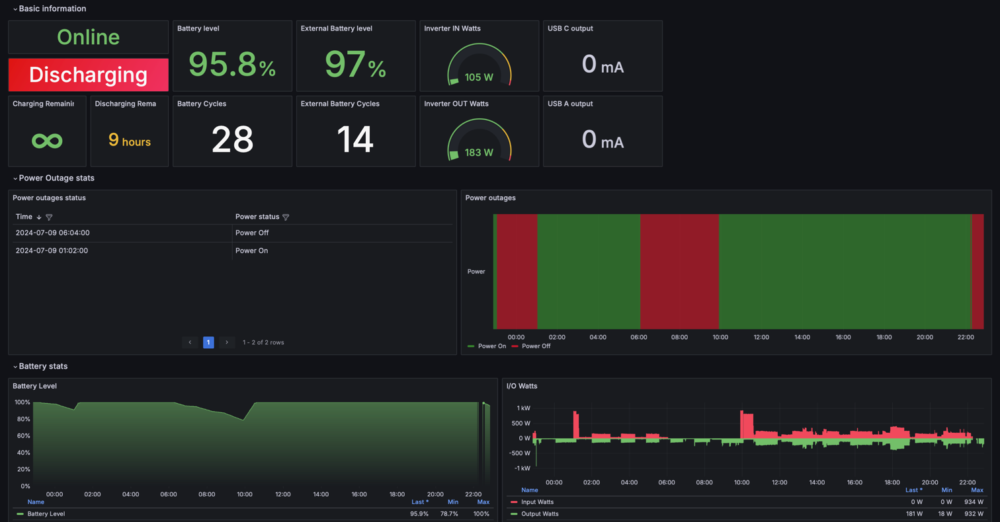

# EcoFlow metric exporter in Go via Rest API

## About the project

This is an Ecoflow metrics exporter different target systems implemented in Go. Currently, the supported target systems
are:

1. Prometheus
2. TimescaleDB
3. Redis

Depending on your configuration you can export the metrics to one of those systems or to all at once.

You can select one of two ways how to fetch data from your Ecoflow devices:

1. Using Ecoflow Rest API
2. Using MQTT

This project uses library https://github.com/tess1o/go-ecoflow to fetch the metrics from your Ecoflow devices via either
REST API or MQTT

## How to get Access Token and Secret Token

This is required if you want to use Ecoflow Rest API. For MQTT only Ecoflow username(email) and password are required

1. Go to https://developer-eu.ecoflow.com/
2. Click on "Become a Developer"
3. Login with your Ecoflow username and Password
4. Wait until the access is approved by Ecoflow
5. Receive email with subject "Approval notice from EcoFlow Developer Platform". May take some time
6. Go to https://developer-eu.ecoflow.com/us/security and create new AccessKey and SecretKey

## Dashboard example

## How to run the Prometheus, Exporter and Grafana using docker-compose

See documentation here: [Prometheus](docs/prometheus.md)

## How to run the TimescaleDB, Exporter and Grafana using docker-compose

See documentation here: [TimescaleDB](docs/timescaledb.md)
TimescaleDB allows to build more complex logic if you want so. For instance, you can calculate how long you had power
outages and how long the grid power was on. Since all metrics are stored in a PostgreSQL database (TimescaleDB to be
precise), you have the power of SQL to build any kind of metrics or reports you want. Prometheus doesn't provide such
flexibility.

## How to run the Redis, Exporter and Grafana using docker-compose

See documentation here: [Redis](docs/redis.md)

## Compare to other exporters

This implementation is inspired by https://github.com/berezhinskiy/ecoflow_exporter, and it's fully
compatible with their grafana dashboard. This exporter by default uses the same prefix for the metrics (`ecoflow`)
Both exporters support all parameters returned by the API. MQTT and Rest API actually return the same set of parameters.
This implementation was tested on Delta 2 and River 2.

Some difference between this project and https://github.com/berezhinskiy/ecoflow_exporter:

1. This project supports exporting parameters via Ecoflow Rest API or MQTT.
2. If you use exporter via Ecoflow Rest API then you don't need to hard code Device Serial Numbers and this exporter can
   export metrics from all linked devices. MQTT exporter on the other hand requires the list of devices. However, you
   can specify all required devices separated by comma and this exporter will do the rest.
   https://github.com/berezhinskiy/ecoflow_exporter can export metrics for a single device only, and you have
   to hardcode it's Serial Number in the env variables. If you have 5 devices, then you need to run 5 instances of the
   exporter
3. This exporter supports sending metrics to Prometheus, TimescaleDB or
   Redis. https://github.com/berezhinskiy/ecoflow_exporter supports Prometheus only.
4. The image size (not compressed!) of this exporter is only 28MB, `ghcr.io/berezhinskiy/ecoflow_exporter` is 142 MB.
   This exporter supports both REST API and MQTT, sending data to Prometheus, Redis, TimescaleDB
5. This implementation is extremely lightweight and barely consumes any RAM & CPU (it needs less than 10MB of RAM to
   fetch metrics from 2 devices)