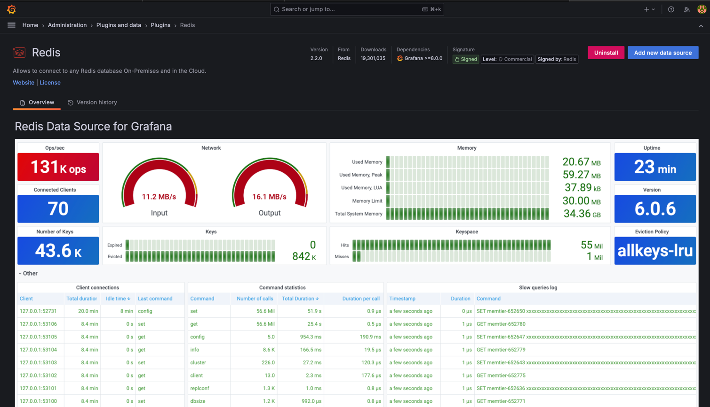
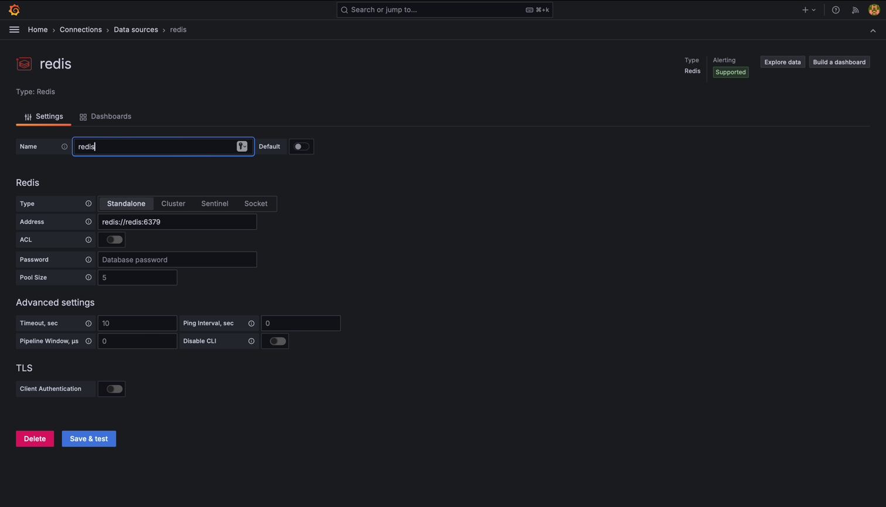
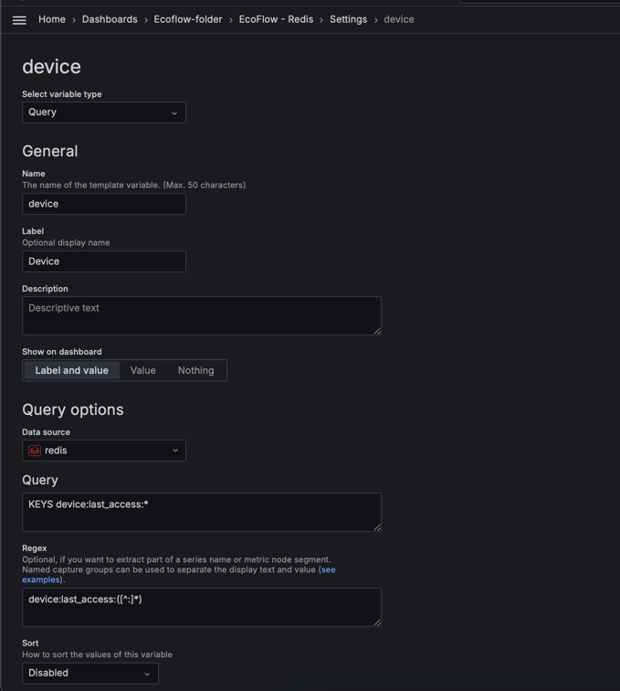

## Data structure

All metrics are stored as TimeSeries with key structure:
`ts:%device_serial_number%:%metric_name%`

For instance:

```
ts:R123YHY5ABCE1346:ecoflow_bms_bms_status_cycles
ts:R123YHY5ABCE1346:ecoflow_bms_bms_status_soc
```

Additionally, there is a key/value to store device SN and last access date:
`device:last_access:%device_serial_number%`
This can be useful when declaring variables in Grafana to fetch all devices you have

## How to run the Redis, Exporter and Grafana using docker-compose

1. Go to docker-compose folder: `cd docker-compose`
2. Update `.env` file with two mandatory parameters:
    - `ECOFLOW_ACCESS_KEY` - the access key from the Ecoflow development website
    - `ECOFLOW_SECRET_KEY` - the secret key from the Ecoflow development website
    - `REDIS_ENABLED` - enable integration with Redis
3. (OPTIONALLY) Update other variables if you need to:
    - `REDIS_URL` - Redis url. Default value: `localhost:6379`
    - `REDIS_DB` - Redis database. Default value: `0`
    - `REDIS_USER` - Redis username. Default value: no value
    - `REDIS_PASSWORD` - Redis password. Default value: no value
    - `METRIC_PREFIX`: the prefix that will be added to all metrics. Default value is `ecoflow`. For instance
      metric `bms_bmsStatus.minCellTemp` will be exported to prometheus as `ecoflow.bms_bmsStatus.minCellTemp`.
    - `SCRAPING_INTERVAL` - scrapping interval in seconds. How often should the exporter execute requests to Ecoflow
      Rest API in order to get the data. Default value is 30 seconds.
    - `DEBUG_ENABLED` - enable debug log messages. Default value is "false". To enable use values `true` or `1`
    - `GRAFANA_USERNAME` - admin username in Grafana. Default value: `grafana`. Can be changed later in Grafana UI
    - `GRAFANA_PASSWORD` - admin password in Grafana. Default value: `grafana`. Can be changed later in Grafana UI
4. Save `.env` file with your changes.
5. Adjust redis persistence configuration if needed at: `docker-compose/redis/redis.conf`
6. Start Redis container: `docker-compose -f docker-compose/redis-compose.yml up -d`
7. Start the exporter and
   grafana: `docker-compose -f docker-compose/grafana-compose.yml -f docker-compose/exporter-remote-compose.yml up -d`
8. The services are available here:
    - http://localhost:3000 - Grafana
    - Redis is available at the value of `REDIS_URL` variable
9. Install Redis plugin: Navigate to http://localhost:3000/plugins/redis-datasource and click on `Install` button

10. Create Redis datasource: Navigate to http://localhost:3000/connections/datasources/new and search for `Redis`.

11. Create your dashboard.

### Grafana dashboard tips

- I suggest to add new Variable "Device" to get the dropdown list of devices. Example:


- If you have Prometheus query defined like `ecoflow_bms_bms_status_cycles{device="$device"}` you can implement the same using Redis:
    - *Datasource*: Redis
    - *Type*: RedisTimeSeries
    - *Command*: TS.GET
    - *Key*: ts:$device:ecoflow_bms_bms_status_cycles

